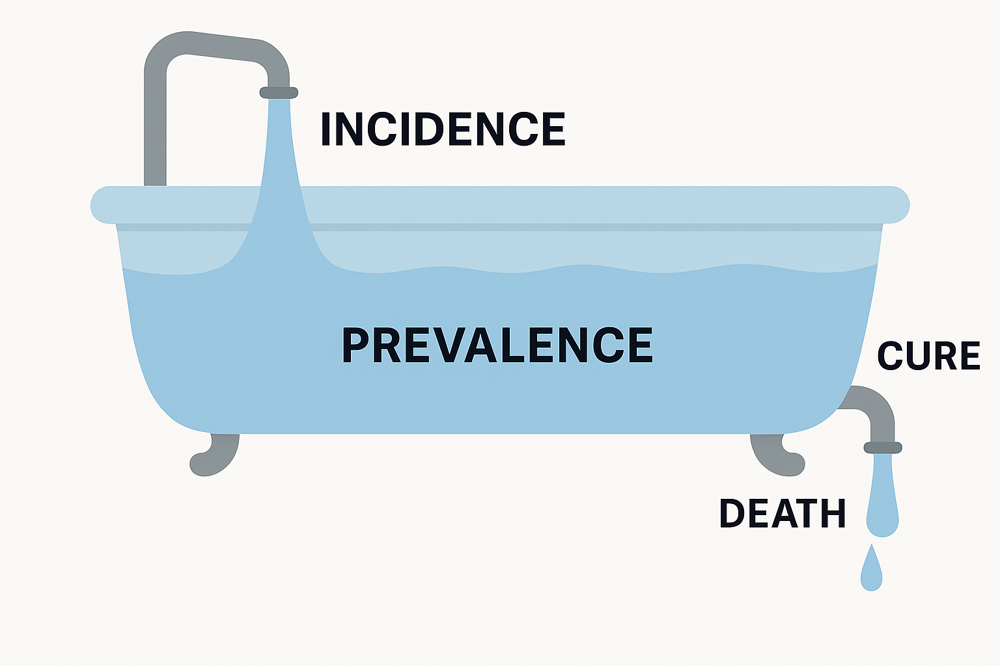

# Introduction

A living guide to planning a clinical research survey.

Welcome! This guide is crafted for students, clinicians, and aspiring researchers who are ready to turn their curiosity into a meaningful research survey. Scientific research, including surveys in medicine and health sciences, begin not with complex methods but with a clear and compelling question. Yet, before you even formulate that question, it's vital to apply a _'common sense'_ filter. The hallmark of impactful research is that it addresses a legitimate gap in our understanding i.e. a problem for which the solution isn't already obvious or simple to implement. This initial mental check ensures that your valuable time and resources are channeled into discovering new knowledge, rather than scientifically proving what is already apparent. A compelling research topic is one where the answer is not only unknown but truly needs the power of scientific inquiry to be found.

This walkthrough will demystify the process, from finding your research topic to planning the practical details, ensuring you can proceed with confidence and scientific rigor in surveys. For a complete research proposal outline [here](https://drive.google.com/file/d/14_7a6IB8dNycSwBHNhEyKrJ4i46flsq2/view?usp=share_link). Survey research or prevalence studies are good to:

1. **Establish foundational clinical standards** when defining population-specific "normal" reference ranges for clinical tests (e.g., blood pressure, cholesterol, growth charts), which is essential for accurate diagnosis and preventing patient harm from inappropriate standards.
2. Provide the critical **prevalence data** required for evidence-based allocation of national health budgets, setting public health priorities, and monitoring the effectiveness of interventions or treatments in clinical care and medical services.
3. **Quantify disease burden** of existing or emerging illnesses in the community providing the objective evidence needed to reveal the actual level of the illness occurrence, or health disparities and to inform the design targeted services for the targeted populations.

From epidemiological standpoint, it is critical to understand that such a cross-sectional study cannot achieve the following study objectives:

1. **Determine Causality**: It cannot establish a cause-and-effect relationship, as exposure and outcome are measured simultaneously, preventing determination of the temporal sequence, except if the exposures are biological parameters that were present at birth e.g., genetic and genomic data, blood type and RF factor, gender, etc.
2. **Evaluate Treatment Effects**: It cannot determine a treatment's efficacy or effectiveness, as it can only show an association, not the cause-and-effect by controlled trials.
3. **Measure Incidence**: It cannot measure the rate of new cases of a disease over time; it only captures existing (prevalent) cases.
4. **Assess Implementation Processes**: It cannot evaluate how well a program was implemented, only its outcome at a single point in time.
5. **Study Rare or Brief Conditions**: It is inefficient for studying rare diseases or those of short duration, as the "snapshot" is likely to miss these cases.
6. **Explore In-Depth Perceptions**: It cannot explore complex lived experiences or the "why" behind behaviours, which requires qualitative methods.

This guide applies equally well to the planning and conduct of **KAP** studies. A Knowledge, Attitude, and Practice (KAP) study is a quantitative cross-sectional survey designed to assess the levels of knowledge, prevailing attitudes (or beliefs/perceptions), and self-reported practices of a specific population regarding a particular health issue, disease, or treatment/intervention. It is often used to:

* Identify knowledge gaps, cultural beliefs, or behavioural patterns that may facilitate or hinder certain health behaviours, treatments or public health programs.
* Establish a baseline for planning health interventions.
* Evaluate the impact of health education or campaigns post-intervention.
* Inform policy and communication strategies. Variants of this study include KABP (Knowledge, Attitude, Beliefs, Practice) and KAPS (Knowledge, Attitude, Perceptions, Skills), which simply add or substitute dimensions but follow the same core principles.

The [Box Information 1](resources/box-1-prevalence-incidence.md) below defines and explains about prevalence and incidence and related concepts that MUST be grasped. For any clinician or researcher, understanding the difference between prevalence and incidence is fundamental. It helps us grasp the burden of a disease and the risk of developing it.

Imagine a bathtub. This bathtub represents a specific population (e.g., a city, a country, or a specific patient group). **Prevalence** is the total amount of water in the tub at a specific moment. It represents all current cases (both old and new) of a disease in the population. If you want to know how many people have the disease right now, you are measuring the prevalence. It's a "snapshot" of the disease burden. **Incidence** is the water flowing into the tub from the faucet. It represents the new cases of the disease that appear in the population over a period of time. Incidence tells you how quickly the disease is spreading or occurring. Cure and Death are the water leaving the tub through the drain. When individuals are cured of the disease or die, they are no longer counted in the prevalence numbers.

  

For samples of published research proposals as journal protocol papers by the author [here](https://drive.google.com/drive/folders/1c4OavVFVQElKiW73voaSRbi792nwLt3U?usp=share_link).

**Key Message**: It is essential to underscore that no research, whether a simple prevalence survey or a nationwide KAP study, can substitute scientific rigor with good intentions alone. The essence of scientific inquiry lies in the integrity and competence of those who conduct it. A research idea, no matter how socially relevant or timely, must pass both the common-sense test and the standards of sound methodology. There can be no tolerance for poorly conceptualized, sloppily executed, or ethically compromised research. Every stage of the process, from topic identification to data analysis, must reflect a commitment to methodological soundness, critical thinking, and academic honesty.
