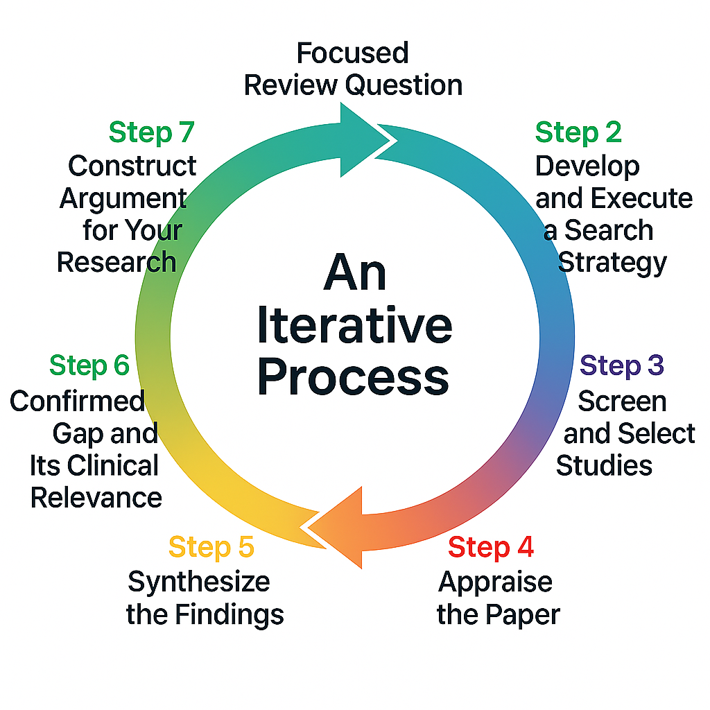

# A Detailed 7-Step Guide to Reviewing Non-Interventional Studies

This elaborates on each step for a literature review focused on _observational evidence_. It builds upon the techniques you've just learned for identifying a potential research gap.

**Crucially, this process is often a cycle, not a straight line.** This is expecially so when reviewing for fast emerging fields that research are actively done and findings being reported. Therefore, be prepared to revisit earlier steps as you learn more, and to re-run the search again at the end of your review if it has been quite awhile. In other areas and topics with less activity, or the early reviewing of papers do not indicate substantial changes in the definition or trend of the research topic, the need to reformulate review question and search strategy are lesser. The review can proceed according to the determined review question, and making note of different, related or emerging concepts about the topics. The following steps are the formal method to explore, confirm, and precisely define the gap you have preliminarily identified. 

  

1.  [Step 1: Start with a Research Gap and Formulate a Focused Question](#step-1-start-with-a-research-gap-and-formulate-a-focused-question)
2.  [Step 2: Develop and Execute a Search Strategy](#step-2-develop-and-execute-a-search-strategy)
3.  [Step 3: Screen and Select Studies Systematically](#step-3-screen-and-select-studies-systematically)
4.  [Step 4: Critically Appraise the Evidence](#step-4-critically-appraise-the-evidence)
5.  [Step 5: Extract and Synthesize the Findings](#step-5-extract-and-synthesize-the-findings)
6.  [Step 6: Define the Confirmed Gap and Its Clinical Relevance](#step-6-define-the-confirmed-gap-and-its-clinical-relevance)
7.  [Step 7: Construct Your Argument and Position Your Research](#step-7-construct-your-argument-and-position-your-research)
8.  [Summary](#summary)

---

## Step 1: Start with a Research Gap and Formulate a Focused Question

Your research journey begins with identifying a potential gap, using the techniques described previously whether it's a **Knowledge Gap** you found in a systematic review, a **Practical Gap** you observed in your clinical practice, or a **Methodological Gap** noted in the limitations of a key paper. This first step is about translating that initial, sometimes vague, gap into a precise and answerable research question using the `PECOTS` framework.

**Action:** State the preliminary research gap you have identified. Then, transform it into a focused `PECOTS` question that you can use to systematically test and explore that gap.

## Step 2: Develop and Execute a Search Strategy

This comprehensive search will now thoroughly investigate the 'gap' you identified. Think like a detective, using a structured approach to find all the relevant evidence.

**Action:** Identify databases (e.g., `PubMed/Medline`, `Scopus`, `CINAHL`), list keywords from your `PECOTS` question, and document your entire search process, including the date and the AI-assisted tools you used (e.g., `Elicit`, `Consensus AI`). At the time of the writing of this guide, AI tools include [Elicit AI](https://elicit.com/), [Silvi AI](https://www.silvi.ai/), [DistillerSR](https://www.distillersr.com/), [EPPI-Reviewer](https://eppi.ioe.ac.uk/cms/Default.aspx?tabid=2914), [Consensus AI](https://consensus.app/), and other assisting tools such as [Perplexity AI](https://www.perplexity.ai/), [Undermind AI](https://www.undermind.ai/), [Evidence Review Accelerator (TERA)](https://tera-tools.com/), [Covidence](https://www.covidence.org/) and [Rayyan](https://www.rayyan.ai/).

> **Reality Check (Iteration Point):** Your search will confirm whether the gap truly exists. You might find it has already been filled, or that it is different than you first thought. This is a critical finding! Be prepared to **go back to Step 1** to refine or even change your `PECOTS` research question.

## Step 3: Screen and Select Studies Systematically

Filter your results fairly using pre-defined rules, focusing on the most relevant study designs for your non-interventional question.

**Action:**
1.  **Set Your Rules:** Before you start, define your **inclusion and exclusion criteria** based on your `PECOTS` question. Be specific about the study designs you will accept (e.g., "Include: cohort and case-control studies." "Exclude: randomized controlled trials, case reports.").
2.  **Do a Two-Pass Screening:**
    * **Pass 1:** Read only the titles and abstracts. Quickly exclude irrelevant articles.
    * **Pass 2:** Read the full text of the remaining articles to make your final decision.

## Step 4: Critically Appraise the Evidence

Observational studies have different potential biases than clinical trials (e.g., confounding). As a clinician, you must judge the quality and reliability of this evidence carefully.

**Action:** Use a standardized checklist designed for observational studies. Do not use a checklist for trials. Excellent tools include the **CASP checklists for Cohort or Case-Control Studies**, or the **Newcastle-Ottawa Scale (NOS)**.

## Step 5: Extract and Synthesize the Findings

This is where you pull the key information out of each paper. For observational studies, you'll be looking for measures of association, not just treatment effects.

**Action:** Create a simple table (a "data extraction form"). Columns should include: `Author & Year`, `Study Design`, `Population (n=...)`, `Exposure`, `Comparator`, `Key Findings (e.g., Odds Ratio [OR], Relative Risk [RR])`, and `Quality Appraisal Notes`. This allows you to easily compare results and identify patterns.

> **Reality Check (Iteration Point):** As you synthesize, you might uncover a new, more nuanced gap you hadn't anticipated. This is a valuable discovery! It may require you to **return to Step 2** to conduct a smaller, more targeted search on this new aspect.

## Step 6: Define the Confirmed Gap and Its Clinical Relevance

After systematically reviewing the literature, you are no longer working with a preliminary gap. This step is about precisely articulating the specific gap that your comprehensive review has now confirmed and defined.

**Action:** Write a clear summary of the confirmed gap. Classify its type (e.g., is it a **Knowledge Gap** because no local Malaysian data exists? Or a **Methodological Gap** because all prior studies used a weak design?). Most importantly, this would explain the "**so what?** - ***The Why & The What***". 

## Step 7: Construct Your Argument and Position Your Research

Finally, use the story you have uncovered to build a compelling and evidence-based case for your own research project. Filling the identified gap with your proposed study objectives and study designs is clinically relevant to your patients or the healthcare system, contributing to the Problem Statement section.

**Action:** Write a clear narrative that flows logically from the initial problem, to the existing evidence, to the **confirmed gap you have precisely defined**, and finally to the justification for your proposed study, which is now positioned to make a valuable new contribution.

---

## Summary
In essence, this 7-step guide provides a structured and iterative framework to move from a preliminary research idea to a fully justified study. The process begins by translating a potential research gap whether identified from clinical practice or from existing literature, into a focused `PECOTS` question. You then systematically search for, screen, and critically appraise the relevant evidence, embracing the iterative nature of research where initial findings may lead you to refine your approach. This rigorous synthesis does more than just summarize what is known, it allows you to confirm, precisely define, and articulate the clinical relevance of the research gap. Ultimately, completing these steps equips you with a powerful, evidence-based argument, positioning your own study to make a meaningful contribution to the field.


### Important Clarification: Do AI Tools Have Access to All Journal Papers?

That is a crucial and highly insightful question. The direct and unequivocal answer is **no, absolutely not.**

As of August 2025, no Large Language Model or AI research assistant whether a general one like `GPT-4` or a specialized platform has true, comprehensive access to all academic literature, especially the full text of journal papers.

Here is a breakdown of why this is the case.

#### Why LLMs Do Not Have Access

1.  **The Academic Publishing Paywall** The vast majority of high-impact scientific literature is locked behind expensive paywalls from publishers like Elsevier, Springer Nature, and Wiley. An LLM does not have a "university library card" to log in and cannot legally scrape this content for its training data.

2.  **Copyright Law and Active Litigation** Training AI on copyrighted material is a contentious legal gray area. To mitigate immense legal risk, AI companies are not transparent about their exact data sources, but they are heavily skewed towards publicly accessible information.

3.  **The Nature of LLM Training (Static Knowledge)** A foundational LLM is trained on a static snapshot of data up to a specific "knowledge cutoff date." It does not know about a paper published yesterday unless it has a live search feature, and even that feature cannot get past paywalls.

#### What Access Do Specialized "AI Research Tools" Have?

Tools like `Elicit` or `Consensus` are not giant brains that have "read" everything. They are sophisticated search interfaces built on top of specific, defined databases.

* **Elicit:** Its access is primarily to the **Semantic Scholar** corpus, which indexes over 200 million papers. Its knowledge is defined and limited by this source, focusing on abstracts and open-access full texts.
* **Consensus AI:** This tool also searches a curated academic database. Its access is limited to the papers within its own indexed collection, which again favors open-access content.
* **Scite.ai:** This tool has agreements with many publishers to analyze the *context* of citations within full-text articles, but this access is not universal and is for the specific purpose of citation analysis.

#### Your Takeaway as a Clinician Researcher

1.  **Treat AI Tools as Powerful Assistants, Not Replacements.** Use them for the initial phases of your review: to identify key papers, explore a topic, and brainstorm search terms. They are excellent for a quick scanning of the landscape of the topics, and finding a preliminary or potential research gap.
2.  **The Gold Standard Has Not Changed.** For a truly rigorous review, the primary method remains a **manual search across multiple databases (`PubMed`, `Scopus`, etc.) performed through your university library's portal.** This is the only way to legally and comprehensively access the full text of paywalled research that is crucial for your field. 
3.  **Never Cite Based on a Summary Alone.** Never write about or cite a research paper based solely on an LLM's summary of it. The LLM may hallucinate details or misinterpret the findings. The core principle of academic integrity remains: you must **read and critically appraise the primary source yourself.**

